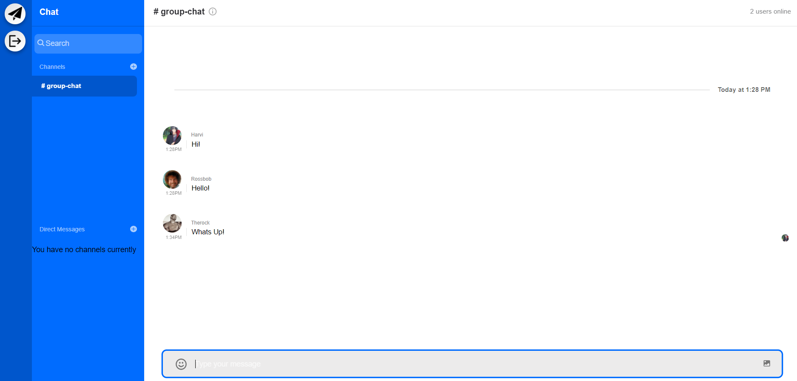

# React-Chatcord

A fully fledged chat application, with a modern design and contains popular features.

Full list of technologies used:

<ul>
<li>React/Javascript(front-end) </li>
<li>node/express.js(back-end) </li>
<li>Stream-Chat-API </li>
</ul>

## Features Include:

### Login & Sign Up page

### Group Chats

### Direct Messages 

### Send Emojis and Images 

